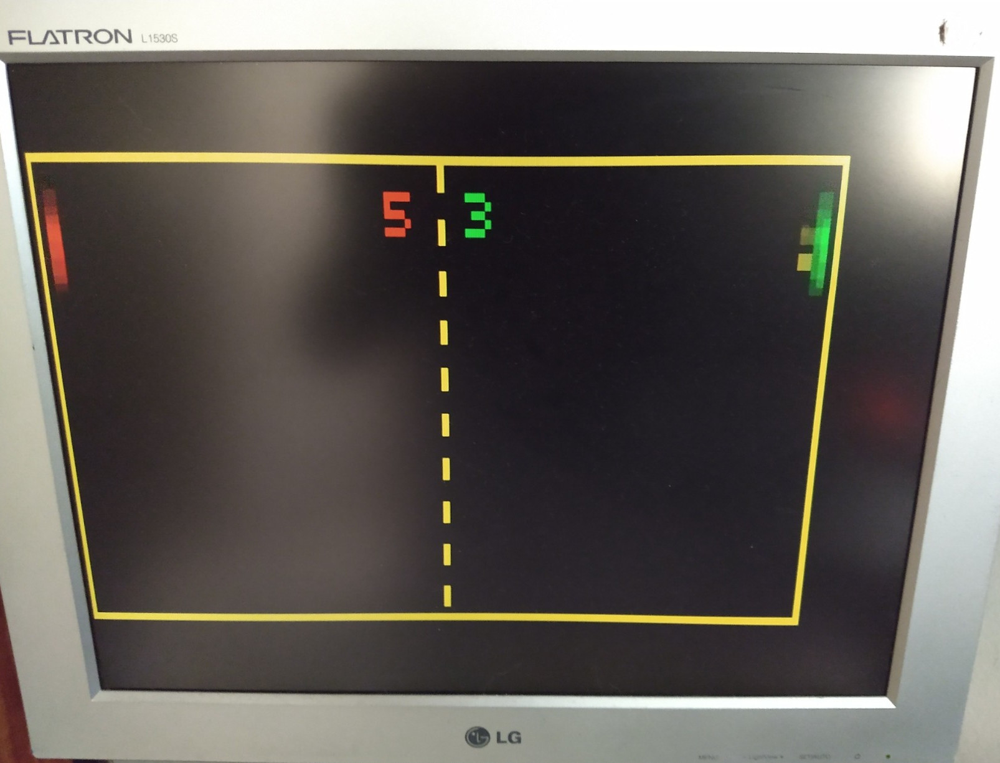

# Arduino VGA Games

Implementación de video juegos mediante la biblioteca VGAx de Arduino, un trabajo de [@Rob+Cai](https://www.instructables.com/member/Rob+Cai/).

## Recursos

- Instructable ["VGA Games 4-in-1"](https://www.instructables.com/Arduino-VGA-Games-4-in-1/)
- Instructable ["Pong With Arduino Uno"](https://www.instructables.com/VGA-Pong-with-Arduino-Uno/)
- Biblioteca ["VGAX Library for Arduino UNO and MEGA"](https://github.com/smaffer/vgax)
- Otra biblioteca para explorar: ["APL"](https://github.com/akund/APL)
- Gabinete 3D ["USB paddle game controller"](https://www.thingiverse.com/thing:4223937)
