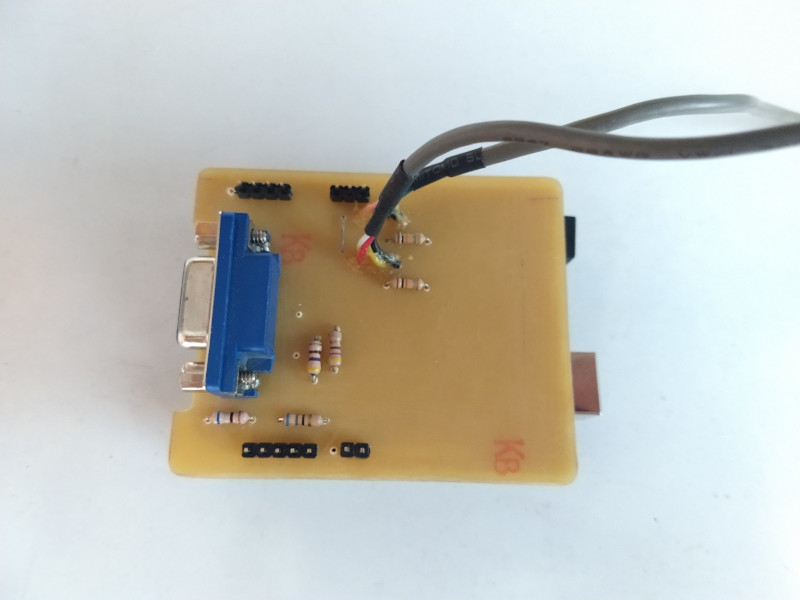

# Arduino VGA Games

Implementación de videojuegos mediante la biblioteca [VGAX de Sandro Maffiodo](https://github.com/smaffer/vgax), un trabajo de [@Rob+Cai](https://www.instructables.com/member/Rob+Cai/). En el foro de Arduino hay un hilo ["Arduino color game (Bomber) using VGA library"](https://forum.arduino.cc/t/arduino-color-game-bomber-using-vga-library/316899) con más información y distintas versiones de juegos.

Uno de los juegos incluidos es [Pong! de Atari](https://es.wikipedia.org/wiki/Pong), el primer videojuego digital. A diferencia de otros, Pong utilizó un circuito totalmente digital para producir los gráficos, el sonido y el control del juego. No hay software ni CPU, sólo una colección de 66 circuitos integrados discretos que realizan una única función, interconectados para crear el juego que conocemos. En **/docs/PongSchematics.pdf** está el diagrama esquemático de la versión arcade original.

## Algunas fotos del primer prototipo

## Recursos

- Instructable ["VGA Games 4-in-1"](https://www.instructables.com/Arduino-VGA-Games-4-in-1/)
- Instructable ["Pong With Arduino Uno"](https://www.instructables.com/VGA-Pong-with-Arduino-Uno/)
- Biblioteca ["VGAX Library for Arduino UNO and MEGA"](https://github.com/smaffer/vgax)
- Otra biblioteca para explorar: ["APL"](https://github.com/akund/APL)
- Gabinete 3D ["USB paddle game controller"](https://www.thingiverse.com/thing:4223937)
- [The original Pong video game had no code](https://www.reddit.com/r/EngineeringPorn/comments/ul49zt/the_original_pong_video_game_had_no_code_and_was/)
- [Fabricating Hardware From The Original Arcade Pong Schematics](https://hackaday.com/2012/12/22/fabricating-hardware-from-the-original-arcade-pong-schematics/)

## Licencia

Tanto la **biblioteca VGAX** como el **firmware original de Rob+Cai** están protegidas por sus respectivas licencias, por favor consulte los sitios donde se alojan para mayor información. El resto del trabajo está protegido por la **Licencia MIT**. Puedes acceder a la versión original de la licencia (en inglés) a través del archivo [LICENSE](./LICENSE) o en línea en [The MIT License (MIT)](https://mit-license.org/). También proporcionamos una traducción no oficial desde [Wikipedia](https://es.m.wikipedia.org/wiki/Licencia_MIT#La_licencia):

Copyright (c) 2024 Lucas Martín Treser

Por la presente se concede permiso, libre de cargos, a cualquier persona que obtenga una copia de este software y de los archivos de documentación asociados (el "Software"), a utilizar el Software sin restricción, incluyendo sin limitación los derechos a usar, copiar, modificar, fusionar, publicar, distribuir, sublicenciar, y/o vender copias del Software, y a permitir a las personas a las que se les proporcione el Software a hacer lo mismo, sujeto a las siguientes condiciones:

El aviso de copyright anterior y este aviso de permiso se incluirán en todas las copias o partes sustanciales del Software.

EL SOFTWARE SE PROPORCIONA "COMO ESTÁ", SIN GARANTÍA DE NINGÚN TIPO, EXPRESA O IMPLÍCITA, INCLUYENDO PERO NO LIMITADO A GARANTÍAS DE COMERCIALIZACIÓN, IDONEIDAD PARA UN PROPÓSITO PARTICULAR E INCUMPLIMIENTO. EN NINGÚN CASO LOS AUTORES O PROPIETARIOS DE LOS DERECHOS DE AUTOR SERÁN RESPONSABLES DE NINGUNA RECLAMACIÓN, DAÑOS U OTRAS RESPONSABILIDADES, YA SEA EN UNA ACCIÓN DE CONTRATO, AGRAVIO O CUALQUIER OTRO MOTIVO, DERIVADAS DE, FUERA DE O EN CONEXIÓN CON EL SOFTWARE O SU USO U OTRO TIPO DE ACCIONES EN EL SOFTWARE.
